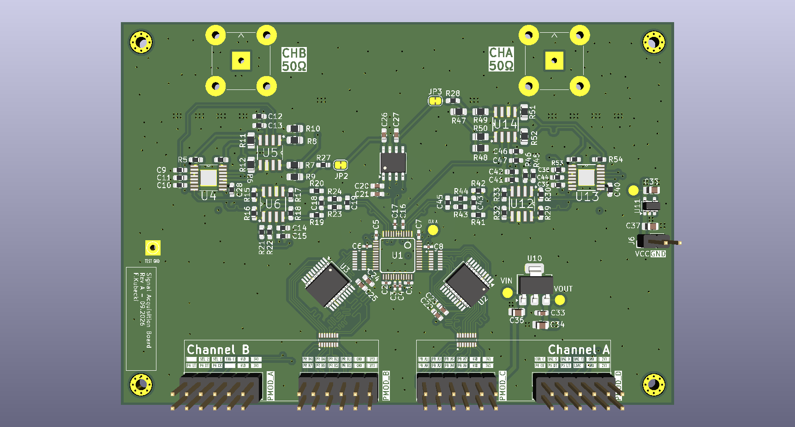

<!-- markdownlint-disable MD013 MD060 -->

# Two-Channel Scope Expansion Board for Arty A7

KiCad design of an analog shield for the Digilent Arty A7 100T. The board plugs into the Pmod connectors and, together with the FPGA design, forms a two-channel digital oscilloscope.

<p align="center">
  
</p>

## Hardware

- **Host board:** Digilent Arty A7 100T (connected via Pmod headers)
- **ADC:** AD9288-100 (dual 8-bit, 100 MS/s)
- **PGA:** AD8370 (variable gain amplifier)
- **DAC:** MCP4822 (DC offset)
- **EDA:** KiCad 10.0

## Related repositories

- FPGA design: [arty-scope-hdl](https://github.com/Filip-Kubecki/arty-scope-hdl)

## Repository structure

```
hardware/      KiCad project (schematic, PCB, project-local libraries)
  libs/        custom symbols, footprints and 3D models
docs/          notes, datasheets, pinout and block diagram
fab/           fabrication outputs - Gerbers, drill, BOM, pick&place (git-ignored, see Releases)
```

## Getting started

Clone the repository:

```bash
git clone https://github.com/Filip-Kubecki/arty-scope-expansion-board.git
cd arty-scope-expansion-board
```

Open `hardware/arty-scope-expansion-board.kicad_pro` in KiCad. Project-local libraries are referenced through `sym-lib-table` and `fp-lib-table`, so no manual setup is needed.

### Generating fabrication files

Fabrication outputs are not stored in git. To generate them:

1. Open the PCB in the PCB Editor.
2. Run **File → Fabrication Outputs → Gerbers** and **Drill Files**, writing to `fab/`.
3. Export BOM and placement files from the Schematic and PCB Editors if needed.

Ready-to-order packages for tagged versions are attached to [GitHub Releases](https://github.com/Filip-Kubecki/arty-scope-expansion-board/releases).

## Status

Work in progress.
